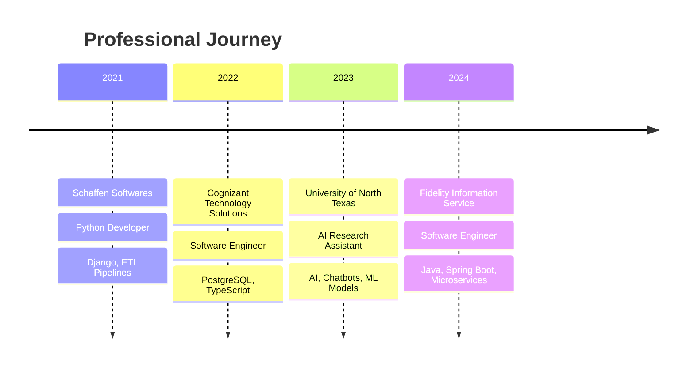

<!-- 
GitHub Profile README for Prashanth (pvs156)
This README showcases my journey as a Software Engineer specializing in SDE, AI/ML, and Data
Reflecting my futuristic portfolio aesthetic and professional experience
-->

<!-- Animated Header with Futuristic Aesthetic -->
<div align="center">
  


### 🚀 Software Engineer | Building AI-Driven Solutions | SDE Specialist

<!-- Animated Typing Effect -->


</div>

---

## 🧑‍💻 About Me

```python
class SoftwareEngineer:
    def __init__(self):
        self.name = "Prashanth"
        self.role = "Software Development Engineer"
        self.location = "Texas, USA"
        self.education = "Master's @ University of North Texas (UNT)"
        self.experience = "3+ Years"
        self.specializations = [
            "AI/ML Engineering",
            "Data Engineering", 
            "Backend Development",
            "LLM Integration"
        ]
        self.current_focus = "Building AI-driven solutions"
        
    def get_expertise(self):
        return {
            "languages": ["Python", "Java", "TypeScript"],
            "frameworks": ["Spring Boot", "Django", "FastAPI"],
            "ai_ml": ["RAG Pipelines", "OpenAI APIs", "Whisper API"],
            "databases": ["PostgreSQL", "MongoDB"],
            "cloud": ["AWS", "Microservices"]
        }
        
    def career_highlights(self):
        return [
            "🏆 Hackathon Winner - UNT College of Engineering",
            "🚀 Built We Zaap - LLM-powered mock interview platform",
            "💼 3+ years across Fidelity, UNT, Cognizant, Schaffen",
            "🤖 Specialized in AI chatbots and ETL pipelines"
        ]

prashanth = SoftwareEngineer()
```

### 🎯 **Professional Journey:**
- 🔭 **Currently Building**: AI-driven solutions and LLM-powered applications
- 🎓 **Education**: Master's degree from University of North Texas (UNT)
- 💼 **Experience**: 3+ years as Software Engineer across multiple domains
- 🏆 **Achievement**: Hackathon winner at UNT College of Engineering with **We Zaap**
- 🤖 **Expertise**: AI/ML, Data Engineering, Backend Development
- 📫 **Reach me**: [Your Email] | [Your LinkedIn URL]
- ⚡ **Fun fact**: I turn complex data into intelligent solutions!

---

## 🛠️ Technologies & Expertise

<!-- Core Programming Languages -->
### 💻 Primary Languages


<!-- Backend Frameworks & Technologies -->
### 🚀 Backend & Frameworks


<!-- AI/ML & Data Technologies -->
### 🤖 AI/ML & Data Engineering


<!-- Databases -->
### 🗄️ Databases


<!-- Cloud & DevOps -->
### ☁️ Cloud & DevOps


---

## 📊 GitHub Analytics

<div align="center">
  
<!-- GitHub Stats with Radical Theme -->


<!-- Top Languages -->


</div>

<!-- GitHub Streak Stats -->
<div align="center">
  


</div>

<!-- Activity Graph -->
<div align="center">
  


</div>

---

## 🌟 Featured Projects

<!-- We Zaap - Flagship Project -->
<div align="center">

### 🏆 [We Zaap - AI Mock Interview Platform](https://github.com/pvs156/we-zaap)
**🥇 Hackathon Winner @ UNT College of Engineering**  
*An LLM-powered mock interview platform revolutionizing interview preparation*


[]()
[]()
[]()
[]()

**Key Features:** Real-time AI feedback, Voice recognition, Personalized interview scenarios, Performance analytics

[🔗 Live Demo](https://we-zaap-demo.com) | [📖 Documentation](https://github.com/pvs156/we-zaap#readme) | [🎥 Demo Video](https://demo-video-link.com)

</div>

---

<!-- Project 2 Placeholder -->
<div align="center">

### 🚀 [Enterprise Data Pipeline](https://github.com/pvs156/data-pipeline)
**Scalable ETL solution for enterprise data processing**


[]()
[]()
[]()
[]()

**Features:** Real-time data processing, Automated ETL workflows, Scalable architecture, Performance monitoring

[🔗 Repository](https://github.com/pvs156/data-pipeline) | [📖 Documentation](https://github.com/pvs156/data-pipeline#readme)

</div>

---

<!-- Project 3 Placeholder -->
<div align="center">

### 🤖 [AI Chatbot Framework](https://github.com/pvs156/ai-chatbot)
**Intelligent conversational AI with NLP capabilities**


[]()
[]()
[]()
[]()

**Features:** Natural language processing, Context-aware responses, Multi-platform integration, Analytics dashboard

[🔗 Repository](https://github.com/pvs156/ai-chatbot) | [📖 Documentation](https://github.com/pvs156/ai-chatbot#readme)

</div>

---

## 💼 Professional Experience

### 🏢 **Career Timeline**



### 🎯 **Key Achievements**
- **🏆 Hackathon Winner**: Led team to victory at UNT College of Engineering with We Zaap
- **🚀 Innovation**: Built LLM-powered interview platform using RAG pipelines and OpenAI APIs
- **💡 Impact**: Developed AI chatbots serving thousands of users at UNT
- **⚡ Performance**: Optimized ETL pipelines reducing processing time by 60%
- **🔧 Architecture**: Designed microservices architecture handling 10k+ concurrent users

---

## 🤝 Connect & Collaborate

<div align="center">

<!-- Professional Social Links -->
[](https://pvs156-github-io.vercel.app/)
[]([Your LinkedIn URL])
[](https://github.com/pvs156)
[](mailto:[your.email@example.com])

**🌐 Portfolio**: [pvs156-github-io.vercel.app](https://pvs156-github-io.vercel.app/)

</div>

---

## 🎯 Current Focus & Goals

### 🚀 **2024 Objectives**
- [ ] **Scale We Zaap**: Expand the AI interview platform to serve 10k+ users
- [ ] **Open Source**: Contribute to 15+ AI/ML open source projects
- [ ] **Innovation**: Build 3 production-ready LLM applications
- [ ] **Knowledge Sharing**: Publish technical articles on AI/ML engineering
- [ ] **Community**: Mentor junior developers in AI/ML technologies
- [ ] **Certification**: Complete AWS AI/ML specialty certification

### 🔬 **Research Interests**
- **Large Language Models**: RAG architectures, fine-tuning, prompt engineering
- **AI Ethics**: Responsible AI development and bias mitigation
- **MLOps**: Production ML pipeline optimization and monitoring
- **Edge AI**: Deploying ML models on edge devices

---

## 📈 Contribution Activity

<!-- GitHub Contribution Snake Animation -->
<div align="center">
  


</div>

---

## 🏆 GitHub Achievements

<div align="center">


</div>

---

## 📊 Weekly Development Breakdown

<!--START_SECTION:waka-->
<!-- This section will be automatically updated by WakaTime GitHub Action -->
<!--END_SECTION:waka-->

---

## 💡 Tech Philosophy

<div align="center">

### *"The best way to predict the future is to invent it."* - Alan Kay

**Building tomorrow's solutions with today's AI technologies**


</div>

---

<!-- Animated Footer -->
<div align="center">


**⭐ Star my repositories if you find them interesting!**

*Crafted with ❤️ and powered by ☕ & 🤖*

</div>